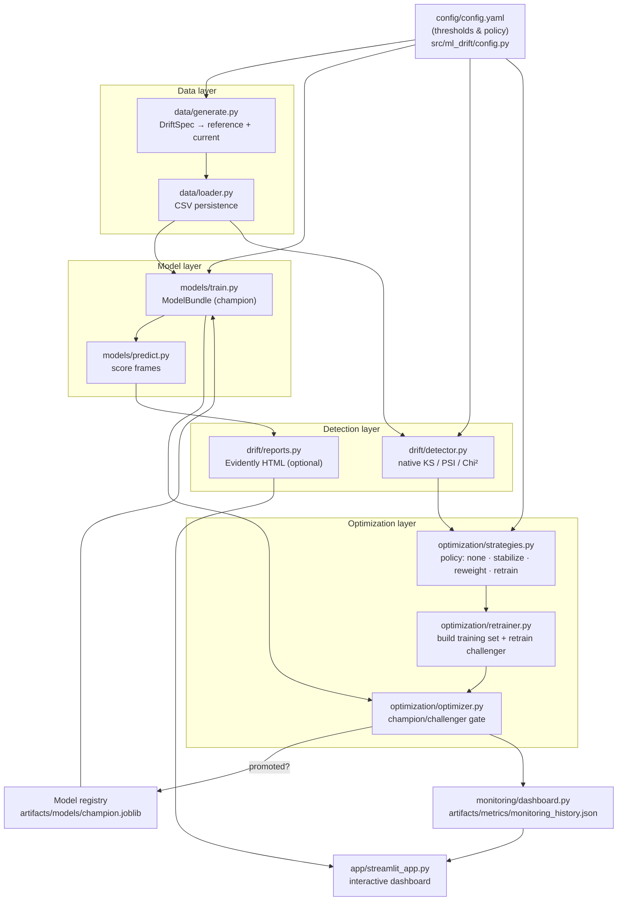

# Architecture

> Companion reference for the series · Start: [01 — Overview](01-overview.md) · Setup: [02 — Setup](02-setup.md)

This document shows how the components fit together, walks the data flow of a
single pipeline run, and records the design decisions and extension points.

---

## 1. Component diagram

Everything above is coordinated by `src/ml_drift/pipeline/orchestrator.py`
(`run_pipeline`, also the `ml-drift` console script), and every box is
independently runnable via `scripts/`.

## 2. Data flow of one run

`run_pipeline(cfg, scenario, ...)` executes seven steps (the numbering below
matches the comments in `orchestrator.py`):

1. **Data.** If `regenerate` is set (default) or the CSVs are missing, generate
   a clean reference batch (`DriftSpec.none()`, `seed`) and a current batch
   (`seed + 1`, the scenario's spec: `none`/`moderate`/`severe`), and save them
   to `data/reference.csv` and `data/current.csv`. Otherwise load the existing
   files.
2. **Champion.** Train the champion on the reference (config-driven model type
   and params) and save it to `artifacts/models/champion.joblib` — or load the
   existing artifact when `retrain_champion=False`. Its validation metrics are
   kept as `champion_before`.
3. **Scoring.** Score both batches with the champion (`score_frame`) so the
   Evidently reports can compare predictions alongside ground truth.
4. **Native detection.** `detect_dataset_drift(reference, current, ...)` runs
   KS + PSI per numeric feature and Chi² + PSI per categorical feature, using
   the thresholds from `config.drift`, and returns a `DriftResult` with the
   per-feature verdicts, the drifted share, and the dataset-level boolean.
5. **Evidently reports (optional).** `generate_all_reports(...)` writes the
   HTML suite to `artifacts/reports/` — skipped gracefully when Evidently is
   not installed (`EVIDENTLY_AVAILABLE` is surfaced in the run summary).
6. **Post-detection optimization.** `optimize_after_detection(...)`:
   - splits `current` into an *adaptation* slice and a held-out *evaluation*
     slice (`eval_fraction=0.3`, stratified);
   - measures the champion on the evaluation slice and computes its
     performance drop vs its own validation baseline;
   - `decide_strategy(...)` picks `none` / `feature_stabilize` / `reweight` /
     `retrain` (or honours a forced strategy from config);
   - `retrain(...)` builds the strategy-appropriate training set from
     reference + adaptation slice and fits a challenger;
   - the **gate**: the challenger is evaluated on the same held-out slice and
     promoted only if `improvement >= min_improvement` and `improvement > 0`
     (when `champion_challenger: true`).
7. **Persistence.** If promoted, the challenger overwrites
   `artifacts/models/champion.joblib` (the "registry"). The full auditable
   summary is written to `artifacts/metrics/<scenario>_run.json`, and — with
   `log_monitoring` — a compact record (scenario, drift share, strategy,
   champion/challenger metrics, promotion) is appended to
   `artifacts/metrics/monitoring_history.json`.

The Streamlit app (`make app`) sits on top: it runs this same pipeline
interactively and renders the drift tables, the Evidently reports, and the
history trend.

## 3. Key design decisions

**Native core, so the loop runs offline.** All *decisions* — per-feature tests,
the dataset-level verdict, the remediation policy, the promotion gate — are
implemented in `drift/detector.py` and `optimization/` on numpy/scipy/sklearn
only. Evidently is a **presentation layer**: `drift/reports.py` degrades to
no-ops when the import fails, the pipeline prints "skipped", and the 28-test
suite passes without it. Alerting logic should never depend on a heavyweight
optional dependency.

**Champion/challenger on a held-out slice of *current* data.** A retrained
model must be judged on the new regime, not the old one — but scoring it on
the same rows it retrained on would leak. The optimizer therefore carves an
evaluation slice off `current` *before* any retraining, trains the challenger
only on reference + the adaptation slice, and compares both models on the
untouched evaluation slice. Promotion is earned, never assumed.

**Config-driven policy.** Every threshold that changes behaviour —
`psi_threshold`, `dataset_drift_share`, `min_drift_share_to_retrain`,
`performance_drop_to_retrain`, `recent_sample_weight`, `champion_challenger`,
`min_improvement` — lives in [`config/config.yaml`](../config/config.yaml) and
is threaded through explicitly as keyword arguments. Tuning the system is an
edit to one YAML file, not a code change, and every run's JSON summary records
what was decided and why (`decision.reason`).

**One serialisable artifact.** `ModelBundle` carries the fitted pipeline *and*
its column layout and metrics, so predict/report/retrain never have to guess
the schema, and promotion is a single `joblib` file swap.

**Everything decomposes.** Each pipeline stage is also a standalone script
(`scripts/generate_data.py`, `train_baseline.py`, `detect_drift.py`,
`optimize.py`, `run_pipeline.py`), which keeps the stages testable and lets CI
smoke-test them independently.

## 4. Extension points

**Swap the model type.** Set `model.type` in the config to
`gradient_boosting` or `logistic_regression` — `build_estimator()` in
`models/train.py` already supports all three. To add a new estimator, add a
branch there; everything downstream only sees the `ModelBundle`.

**Add a remediation strategy.** Three touch points:
1. add a member to the `Strategy` enum and a branch in `decide_strategy()`
   (`optimization/strategies.py`) describing *when* it applies;
2. implement *how* it builds its training set in `retrain()`
   (`optimization/retrainer.py`);
3. optionally expose new knobs in `config.yaml` and thread them through
   `optimize_after_detection(...)` and the orchestrator.
The champion/challenger gate applies to your strategy automatically.

**Plug in a real dataset.** Replace step 1: load your own reference/current
frames (or just point `paths.reference_data` / `paths.current_data` at your
CSVs and run with `--no-regenerate`). Requirements: a binary target column
named in `data.target`, and numeric/categorical dtypes that
`_infer_feature_types` can classify. Detection, policy, retraining, and the
gate are schema-agnostic.

**Wire a real Evidently workspace.** `drift/reports.py` currently emits static
HTML. To move to continuous monitoring, push the same
`reference_scored`/`current_scored` frames to an Evidently workspace or
collector service, and keep the native detector as the offline decision core —
the two layers are already decoupled, so this is additive.

**Schedule it.** `.github/workflows/ci.yml` already runs the pipeline in CI;
a cron trigger plus `python scripts/run_pipeline.py --no-regenerate
--log-monitoring` against fresh production extracts turns this into a
recurring drift check (see [docs/07](07-cicd-and-deployment.md)).

---

Further reading: [01 — Overview](01-overview.md) for the drift taxonomy and
strategy table · [03 — Data & training](03-data-and-training.md) for
`DriftSpec` and `ModelBundle` internals.
